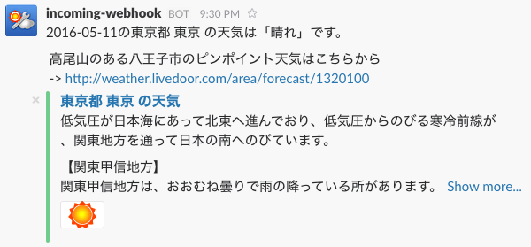

# slack-weather-notifier
Weather notifier on Tokyo to Slack.



## Usage
```
git clone git@github.com:nafu/slack-takaosan-weather-notifier.git
cd slack-takaosan-weather-notifier
export WEBHOOK_URL="your team webhook url"
ruby slack-weather-notifier.rb
```
